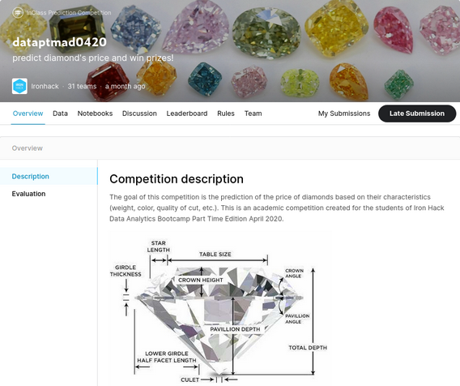

# ih_datamadpt0420_project_m3



# 1. NAME: Competition preparation for a **diamonds** dataset, in order to predict the price value using machine learning

# 2. STATUS: Project Module 3 for **Ironhack Data Analysis Bootcamp**

# 3. ONE-LINER: 
#### With this project data analysis the reader can see which models has been used for price prediction from Sklearn ML library.
#### We have developed a prediction using testing several model types like linear regression, ensemble, tree decision, and others. 
#### We have included in our analysis the estimation with sinthetic variables like volume and density of dymond. We also do prediction modifying metaparameters of several models.
#### We have used kaggle.com to the competition

# 4. TECHNOLOGY STACK: 

   - We use **python** as a base code lenguage.
   - The library we have use in this project are the following,
        - Panda
        - Matplotlib
        - SKlearn
        - Lightgbm


# 5. CORE TECHNICAL CONCEPTS AND INSPIRATION

   - The given dataset of Diamond is a table with information about thousands diamonds with the following features (columns),
        - Id
        - Carat
        - Cut
        - Color
        - Clarity
        - Depth
        - Table
        - x
        - y
        - z

    - The first thing to do, is the investigation about new sinthetics variables and the implementation (volume and density).
    - The plan is to work in julyter notebooks with the datasets (diamonds_predict.csv=TRAIN and diamonds_train.csv=TEST) to get the best score possible in price prediction (RSME around 500) avoiding overfitting.
    - To do prediction we used the following tools and models:
            > Mean Squared Error
            > Cross Validation Score
            > Grid Search
            > Lasso
            > ARDRegression
            > RandomForestRegressor
            > ExtraTreesRegressor
            > AdaBoostRegressor
            > BaggingRegressor
            > GradientBoostingRegressor
            > VotingRegressor
            > DecisionTreeRegressor
            > DecisionTreeClassifier
            > KNeighborsRegressor
            > StackingRegressor
            > RadiusNeighborsRegressor
            
    - We submit to the competition in Kaggle the best score I was getting after testing one by one all models. You can check all submissions in Data folder.
    - Herewith the final rank of competition.

 

# 6. USAGE: 

#### Follow the competition in kaggle.com


# 7. FOLDER STRUCTURE
```
└── project
    ├── README.md
    ├── notebooks
        ├── 01=OnlyMean.ipynb
        ├── 02=LinReg=Baseline.ipynb
        ├── 03=LinReg=Several.ipynb
        ├── 04=Guide-Lesson=Tree.ipynb
    │   └── 05=Guide-Lesson=Others.ipynb
    └── data
```


# 8. CONTACT INFO 

####       aarvillag@gmail.com